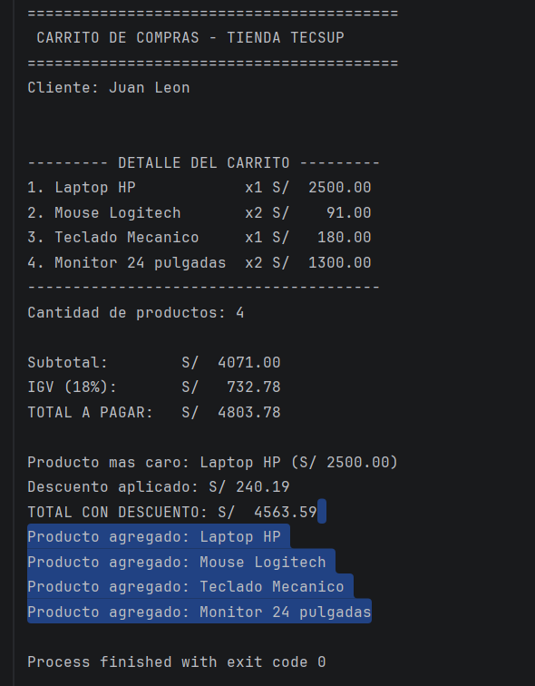

#Lab02 - Carrito de Compras en Kotlin

#Nombre: Becker Yldefonso Solis
#Curso:Programación en Móviles- 4to Ciclo
#Docente:Juan León Suiyon

#Descripción
Programa de consola en Kotlin que simula un carrito de compras. Implementa:
- Una `data class Producto` para modelar los productos.
- Funciones para calcular subtotal, IGV (18%) y total.
- Reporte de detalle con columnas alineadas usando `String.format`.
- Cálculo del producto más caro con `maxByOrNull`.
- Descuento automático según el monto total, usando `when` (5% si supera S/ 3000, 10% si supera S/ 5000).

#Captura de la consola final

#Reflexión: val vs var
En la `data class Producto`, `nombre` y `precio` son `val` porque una vez creado el producto esos datos no deberían cambiar (son características fijas del producto). En cambio `cantidad` es `var` porque el usuario puede agregar o quitar unidades del mismo producto en el carrito, por lo que ese valor sí necesita poder modificarse.
Si se intenta cambiar `precio` después de crear el producto (por ejemplo `producto.precio = 100.0`), Kotlin marca un error de compilación, porque `val` genera una propiedad de solo lectura (sin `setter`).