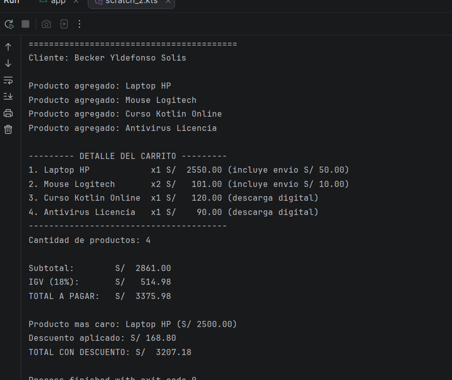

# Lab02 - Carrito de Compras en Kotlin (POO)

**Nombre:** Becker Yldefonso Solis
**Curso:** Programación en Móviles - 4to Ciclo
**Docente:** Juan León Suiyon

## Descripción
Versión orientada a objetos del carrito de compras en Kotlin. Se aplican los 4 pilares de la POO:

- **Abstracción:** `Producto` es una clase abstracta que define las propiedades comunes (`nombre`, `precio`, `cantidad`) y el método abstracto `calcularImporte()`, sin implementar el cálculo.
- **Herencia:** `ProductoFisico` y `ProductoDigital` heredan de `Producto`, reutilizando sus propiedades y agregando comportamiento propio.
- **Polimorfismo:** cada subclase sobrescribe `calcularImporte()` y `mostrarInfo()` con su propia lógica (el producto físico suma costo de envío, el digital no). Al recorrer una `List<Producto>` y llamar estos métodos, cada objeto ejecuta su propia versión.
- **Encapsulamiento:** la clase `Carritoo` mantiene la lista de productos como `private`, exponiendo solo métodos públicos (`agregarProducto`, `eliminarProducto`, `calcularSubtotal`, etc.) para interactuar con ella.

## Estructura del proyecto
- `Producto.kt` — clase abstracta base
- `ProductoFisico.kt` — hereda de Producto, agrega costo de envío
- `ProductoDigital.kt` — hereda de Producto, sin costo de envío
- `Carritoo.kt` — clase que encapsula la lista de productos y la lógica del carrito
- `MainCarritoPOO.kt` — punto de entrada, arma el carrito y muestra el reporte

## Estructura del prompt usado con IA
1. Se solicitó identificar qué archivos/clases se necesitaban para modelar un carrito de compras aplicando los 4 pilares de POO en Kotlin.
2. Se pidió el código de cada clase de forma incremental, respetando la separación: clase abstracta → subclases con herencia → sobrescritura de métodos (polimorfismo) → clase contenedora con encapsulamiento → función main de integración.
3. Se solicitó dividir la entrega en 6 commits, uno por cada avance funcional del proyecto.

## Prompt usado (resumen)
"Necesito un carrito de ventas en Kotlin orientado a objetos, con las clases Producto (abstracta), ProductoFisico y ProductoDigital (herencia), sobrescritura de métodos (polimorfismo) y una clase Carrito con encapsulamiento (lista privada con métodos públicos). Debe dividirse en 6 commits y mantener la misma lógica de cálculo del carrito original (subtotal, IGV 18%, descuento con when, producto más caro)."

##Captura de la consola final

