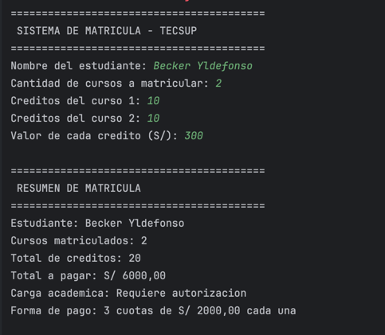

# Sistema de Matricula - Ejercicio de Laboratorio (Kotlin)

**Estudiante:** Becker Yldefonso Solis
**Asignatura:** Programación en Móviles - 4to Ciclo
**Docente:** Juan León Suiyon

## Descripción
Programa de consola en Kotlin (sin POO) que simula el proceso de matrícula de un estudiante, aplicando estructuras condicionales para determinar la carga académica y la forma de pago. El programa permite:

1. Ingresar el nombre del estudiante y la cantidad de cursos a matricular.
2. Ingresar los créditos de cada curso y el valor de cada crédito.
3. Calcular el total de créditos matriculados y el monto total a pagar.
4. Determinar la carga académica según el total de créditos, usando condicionales:
    - Hasta 12 créditos: Malla regular
    - De 13 a 18 créditos: Carga completa
    - Más de 18 créditos: Requiere autorización
5. Determinar la forma de pago según el monto total:
    - Si supera S/ 1500: se paga en 3 cuotas
    - Si no supera S/ 1500: se paga en 2 cuotas
6. Mostrar un resumen final con: cursos matriculados, total de créditos, total a pagar, carga académica y forma de pago.

## Estructura del desarrollo (commits)
1. **Inputs:** captura de datos del estudiante (nombre, cursos, créditos, valor del crédito).
2. **Cálculos:** determinación del total a pagar, la carga académica y la forma de pago mediante condicionales.
3. **Resultados:** impresión del resumen final de la matrícula.

## Explicación del prompt usado con IA
Se solicitó a la IA un programa en Kotlin sin uso de Programación Orientada a Objetos, estructurado en un solo archivo, que implementara lógica condicional para dos decisiones distintas (carga académica y forma de pago) a partir de datos ingresados por el usuario mediante consola. Se pidió explícitamente que el desarrollo se dividiera en 3 partes correspondientes a 3 commits: entrada de datos, procesamiento/cálculos, y presentación de resultados, replicando un flujo típico de programas de consola (input → proceso → output).

**Prompt usado (resumen):**
"Necesito un programa en Kotlin (sin POO, un solo archivo) que simule un sistema de matrícula universitaria usando condicionales. Debe pedir nombre del estudiante, cantidad de cursos, créditos de cada curso y valor del crédito; calcular el total de créditos y el total a pagar; determinar la carga académica (malla regular, carga completa o requiere autorización) y la forma de pago (2 o 3 cuotas) según el monto total. Debe dividirse en 3 commits: inputs, cálculos y resultados."

## Resultado en consola

