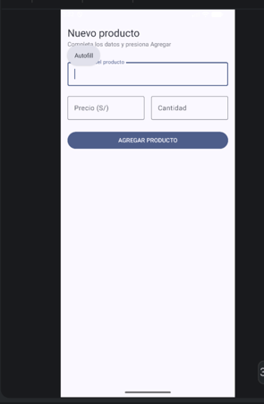
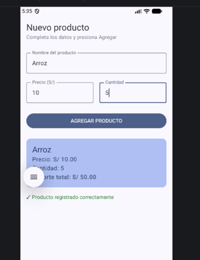

# Laboratorio 03: Formulario de Registro de Productos en Jetpack Compose

**Estudiante:** Yldefonso Solis Becker 
**Paquete:** `com.yldefonso.lab03`  
**Fecha:** 4 septiembre 2026

---

## Descripción del Proyecto

Esta aplicación desarrollada en Android Studio utilizando Jetpack Compose** y Material Design 3 permite realizar el registro rápido de un producto.

El formulario solicita los datos de entrada del usuario (nombre, precio unitario y cantidad), realiza la conversión segura de los datos numéricos mediante `toDoubleOrNull()` y `toIntOrNull()` junto con el operador Elvis (`?:`) para evitar errores en tiempo de ejecución, y calcula automáticamente el importe total a pagar mostrando una tarjeta de resumen (`Card`) y un mensaje de confirmación cuando el usuario presiona el botón "Agregar Producto".

---

## Capturas de Pantalla

## Pregunta de Análisis

### **¿Qué pasaría si declaras las variables de los campos SIN `remember`?**

**Respuesta y explicación:**

Si declaras las variables de estado únicamente usando `mutableStateOf("")` sin la función `remember` (por ejemplo: `var nombre = mutableStateOf("")`):

1. **Pérdida de estado en cada recomposición:** Cada vez que el usuario escribe un solo carácter en cualquiera de los campos (`OutlinedTextField`), Compose dispara un proceso de **recomposición** (re-ejecución) de la función `@Composable PantallaRegistro`.
2. **Reinicio a valor inicial:** Al no usar `remember`, la variable no conservará su valor previo guardado en memoria durante la recomposición. En su lugar, la variable volverá a inicializarse desde cero con su valor por defecto `""` (cadena vacía).
3. **Efecto visual:** Es imposible escribir en las casillas de texto, ya que la pantalla se redibuja inmediatamente restableciendo todos los datos ingresados al estado inicial. `remember` es indispensable porque actúa como el mecanismo de persistencia en memoria local del ciclo de vida del Composeable.