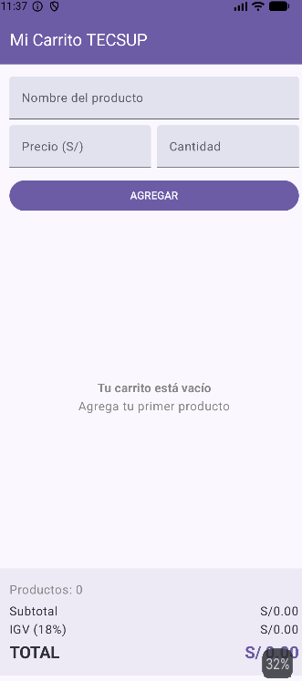
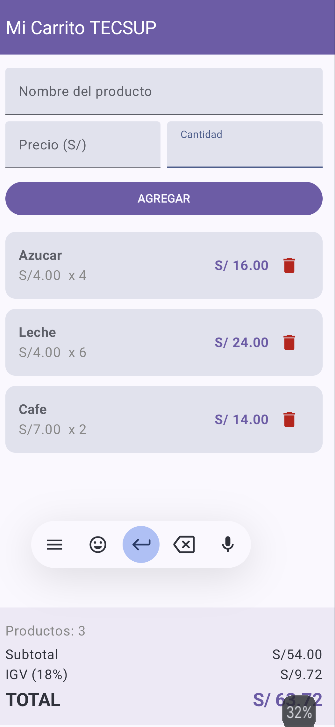

Lab 04 - Carrito de compras

Nombre: Becker Yldefonso

Descripción

Aplicación de carrito de compras desarrollada con Jetpack Compose para el curso de Desarrollo de Aplicaciones Móviles (TECSUP). Permite registrar productos indicando nombre, precio y cantidad, visualizarlos en una lista dinámica mediante LazyColumn, eliminarlos individualmente desde cada tarjeta, y calcula en tiempo real el subtotal, el IGV (18%) y el total de la compra. La interfaz reacciona automáticamente a los cambios en la lista de productos gracias al uso de estado observable (mutableStateListOf).

Capturas
Carrito vacío

Carrito con productos

Respuestas conceptuales

a) ¿Por qué mutableStateListOf y no una MutableList normal?

Porque mutableStateListOf está integrado con el sistema de estado de Compose: cuando se agrega o elimina un elemento, Compose se entera automáticamente y vuelve a dibujar (recompone) las partes de la interfaz que dependen de esa lista. Con una MutableList normal, el cambio ocurriría "por detrás" sin que Compose se entere, así que la pantalla no se actualizaría sola al agregar o eliminar productos.

b) ¿Por qué la lista es val?

Porque nunca se necesita reemplazar la lista completa por otra distinta; solo se modifica su contenido (agregando o quitando elementos), y eso lo permite val siempre que el objeto en sí sea mutable por dentro, como ocurre con mutableStateListOf. val únicamente impide reasignar la variable a una nueva lista, no impide modificar el contenido de la lista actual.

c) ¿Qué hace weight(1f) en la LazyColumn?

Le indica al Column padre que la LazyColumn debe ocupar todo el espacio vertical disponible que quede después de descontar el espacio fijo del formulario y del panel de totales, en lugar de crecer solo según su contenido. Así, la lista de productos se desplaza (scroll) cuando hay muchos productos, mientras el panel de totales permanece siempre visible y fijo en la parte inferior de la pantalla.