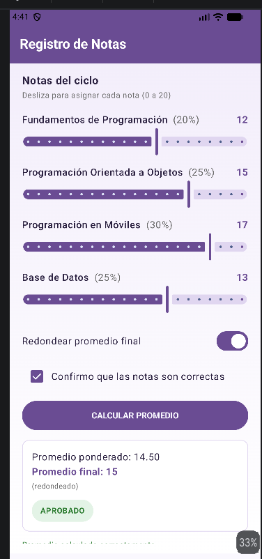

Registro de Notas - Laboratorio 03

Descripcion del problema###

Se pidio crear una app en Android Studio con Jetpack Compose que permita registrar las notas de 4 cursos de un ciclo academico mediante sliders, calcular el promedio ponderado del estudiante y mostrar una observacion automatica del resultado, incluyendo la opcion de redondear el promedio final y de confirmar los datos antes de calcular.

Resumen de lo realizado###

Se construyo una sola pantalla en MainActivity.kt con Jetpack Compose. Se usaron Slider para las notas de cada curso, Switch para activar el redondeo, Checkbox para confirmar los datos, y Button para disparar el calculo del promedio ponderado, el promedio final y la observacion correspondiente mediante una estructura when. El resultado se muestra en una tarjeta con un chip de color segun el estado obtenido. El desarrollo se dividio en 3 commits: estructura base, logica de calculo, y ajuste de estilo visual.

Resultado en el emulador###

